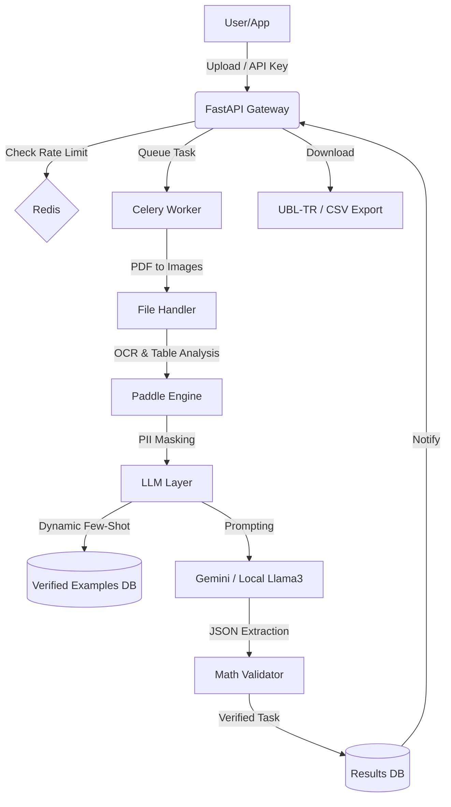

# 📄 Smart Document Processing (IDP) System - Corporate V4

Bu sistem, taranmış dokümanlardaki (fatura, form, dekont, çok sayfalı PDF) verileri **PaddleOCR (PP-OCRv5)** ve **Large Language Models (LLM)** kullanarak yüksek doğrulukla ayıklayan, yapılandıran ve kendi kendine öğrenebilen uçtan uca bir kurumsal veri işleme platformudur.

## 🚀 Öne Çıkan Özellikler (V4 Modernizasyonu)

- **⚡ Asenkron Mimari:** İşlemler FastAPI, Celery ve Redis kullanılarak arka planda kuyruğa alınır. Büyük PDF dosyaları sistemi bloklamadan işlenir.
- **📄 Çok Sayfalı PDF Desteği:** PyMuPDF entegrasyonu ile çok sayfalı dokümanlar yüksek çözünürlüklü görsellere dönüştürülerek sayfa sayfa işlenir.
- **📊 Akıllı Tablo Analizi:** **PaddleStructure (PPStructure)** ile dokümanlardaki tablolar otomatik tespit edilir ve Markdown formatına dönüştürülerek LLM'e beslenir.
- **🧠 Kendi Kendine Öğrenme (Self-Learning):** İnsan-in-the-loop geri bildirim döngüsü ile hatalar düzeltilir. Sistem, bu düzeltmeleri **Dinamik Few-Shot** olarak kullanarak benzer dokümanlarda hata yapmamayı öğrenir.
- **🔒 Kurumsal Güvenlik & KVKK:**
  - **API Auth:** X-API-KEY tabanlı yetkilendirme ve departman yönetimi.
  - **Rate Limiting:** Redis tabanlı hız sınırlaması (20 istek/dakika).
  - **PII Masking:** Hassas verilerin (TC No, IBAN, Tel) LLM'e gitmeden önce maskelenmesi ve sonuçta geri yüklenmesi.
- **📈 Dashboard & Analitik:** Chart.js destekli görsel panel ile başarı oranları, işlem süreleri ve doküman dağılımı takibi.
- **🏦 Finansal Doğrulama:** Hiyerarşik matematiksel kontrol motoru ile ara toplamlar ve vergilerin genel toplamla tutarlılığı %100 denetlenir.
- **📂 Kurumsal Export:** Sonuçların **UBL-TR 2.1 (XML)** e-Fatura formatında veya **CSV** olarak indirilmesi.
- **☁️ Hibrit LLM Desteği:** Gemini 1.5 Flash (Bulut) veya Llama 3 / Mistral (Yerel - Ollama) ile çalışma imkanı.

## 🛠 Teknik Yığın (Tech Stack)

| Katman | Teknoloji |
| :--- | :--- |
| **Backend** | Python 3.10+, FastAPI |
| **Task Queue** | Celery & Redis |
| **OCR & Layout** | PaddleOCR (PP-OCRv5), PaddleStructure |
| **Intelligence** | Gemini 1.5 Flash / Llama 3 (Ollama) |
| **Database** | SQLite & Redis (Metadata & Rate Limit) |
| **Frontend** | Vanilla JS, CSS (Responsive), Chart.js |
| **Altyapı** | Docker & Docker Compose |

## 📐 Sistem Mimarisi



## 📦 Kurulum ve Başlatma

### 1. Docker ile (Önerilen)

```bash
docker-compose up --build
```

### 2. .env Yapılandırması

Proje kök dizininde bir `.env` dosyası oluşturun:
```env
LLM_API_KEY=your_gemini_api_key
REDIS_URL=redis://localhost:6379/0
CELERY_BROKER_URL=redis://localhost:6379/1
# Yerel Model Kullanımı İçin (Opsiyonel):
LLM_PROVIDER=GEMINI # veya LOCAL
LLM_MODEL=gemini-1.5-flash # veya llama3
LOCAL_LLM_URL=http://localhost:11434/v1
```

### 3. İlk API Key Oluşturma

Sistemi kullanmaya başlamak için bir API anahtarı üretin:
`http://localhost:8000/setup-key?name=Departman_Adi`

## 📖 Kullanım Rehberi

1.  **Giriş:** Ürettiğiniz API Key'i ana sayfadaki `X-API-KEY` alanına yapıştırın.
2.  **Yükleme:** PDF veya görsel dosyanızı sürükleyin. KVKK Modu'nu seçerek anonimleştirme yapabilirsiniz.
3.  **Analiz:** İşlem bittiğinde hiyerarşik sonuçları ve matematiksel doğruluğu kontrol edin.
4.  **Eğitim (Self-Learning):** Eğer AI çıktısında hata varsa, JSON editöründen düzeltin ve **"Sisteme Öğret"** butonuna basın. Gelecekteki benzer dokümanlar bu düzeltmeyi referans alacaktır.
5.  **Analytics:** Dashboard üzerinden sistem verimliliğini ve başarı oranınızı izleyin.

---
*Geliştiren: Sueda Akça*